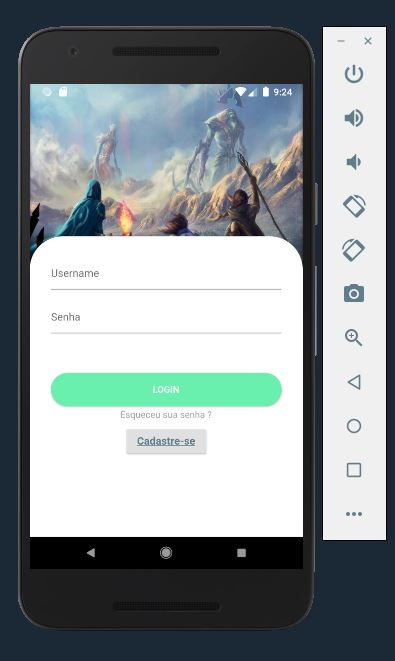

# crup_api

Projeto Flutter -  Estudo de UI Declarativa

# 💻 Meu rei... pra que tá fazendo isso ??

Criar e acompanhar os decks do MTGArena =]
Estudar e Melhorar meu nível com FrontEnd

## Mas então meu rei ... oq tem nisso ?
- [x] Flutter (Really ??)
- [x] Firebase
- [x] API Scryfall
- [ ] Código BEM ESCRITO

#Layout

  

